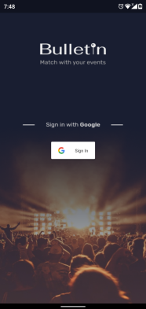
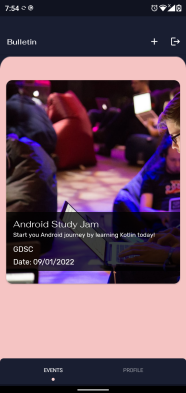
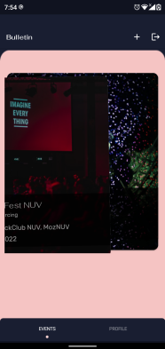
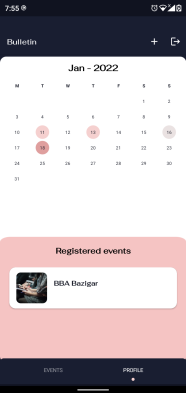
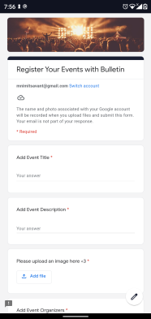

# Bulletin!
Bulletin helps you to "swipe" through your favorite events in the campus and gives you the perfect match for your better experience. Right swipe to add event to your calendar and left swipe to view the next event.

## Screenshot

## Features

- Basically a digital bulletin board
- Access a variety of events, both in and out of your comfort zone
- Register for the events, via right swipe and Ignore with left swipe
- Once the event is added, it will appear on the calendar
- Register new events onto bulletin: Submit event details via google form embedded in the app and the admin will check the validity of the event, and then add it to the db

## Built with 
- Kotlin
- Firebase
- Android studio
## License

Distributed under the [MIT](https://choosealicense.com/licenses/mit/) License.

## Authors

- [@shreyaparadkar](https://www.github.com/shreyaparadkar)
- [@ashwinadiga01](https://www.github.com/ashwinadiga01)
- [@nimit2801](https://www.github.com/nimit2801)

## Future updates

- Have registration forms/tickets for each event embedded inside the app itself.
- Have a separate admin login, to allow adding new events
- Display more details about the event, like the timeline, sponsors and registered participants

